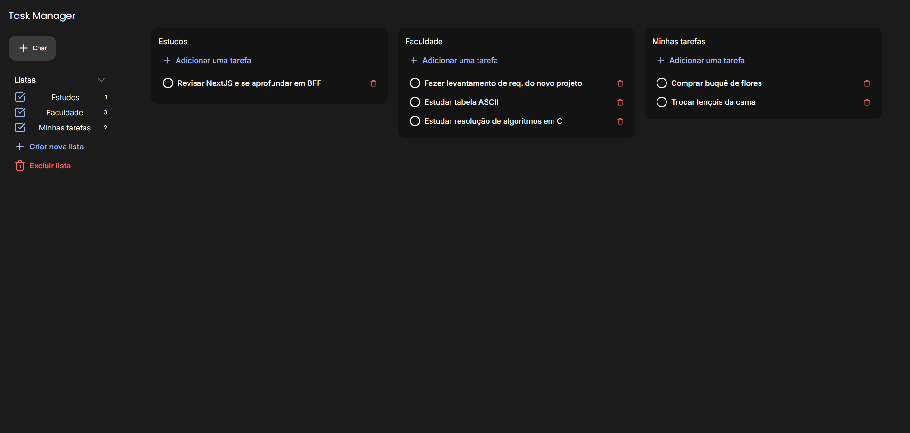

# Task Manager

Um simples task manager inspirado no Google Tarefas. Projeto criado com propósito de praticar padrões de desenvolvimento do mercado e boas prática com React puro.


## Autores

- [@samuelmedeirosjs](https://www.github.com/samuelmedeirosjs)


## Demo


## Funcionalidades

- Botão de criar tarefas rápido  
- Listas/categorias personalizadas
- UX aprimorada com elementos arrastáveis
- [...]


## Instalação e uso local

Com npm instalado na máquina, rode os comandos abaixo

```bash
  git clone https://github.com/samuelmedeirosjs/task-manager
  cd task-manager
  npm i
  npm run dev
```

e acesse a porta local aberta pelo servidor